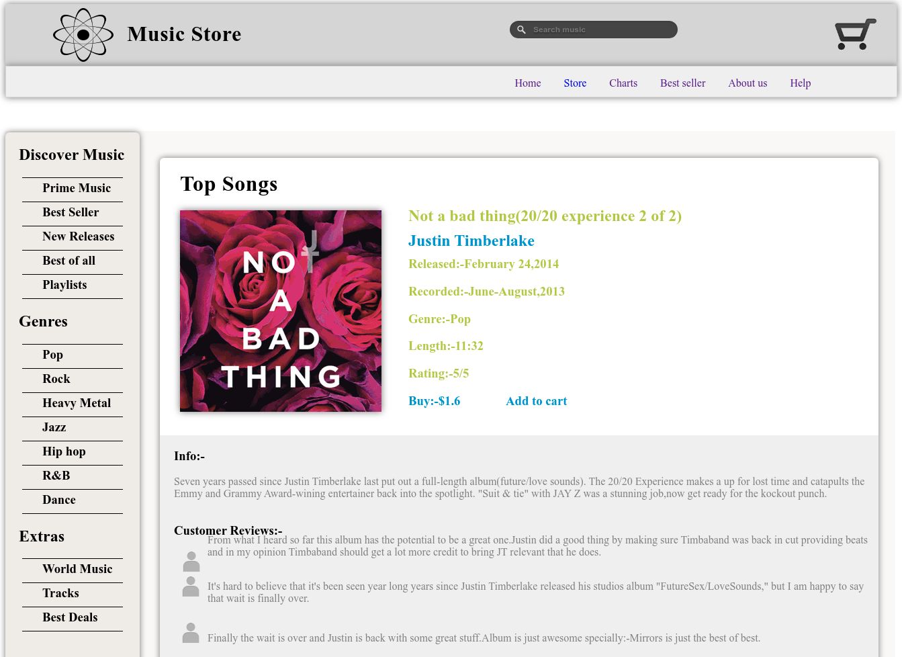
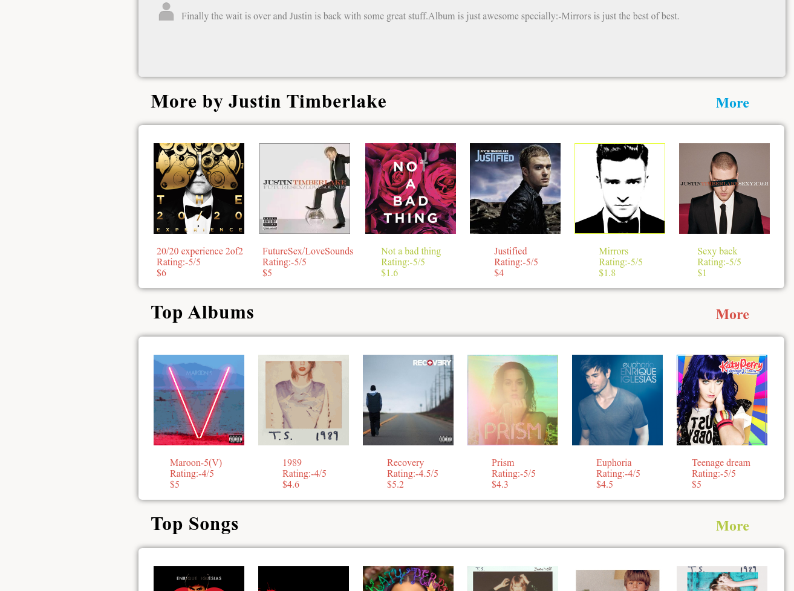

## Project Description - 

The project is made for the illustration purpose to show case the design of a music store made using HTML,CSS and JS. The template is consist of 5 pages that illustrates the different design of pages from home page to the artist page. The design elements are inspired from the google material design and single color tone are used.

### Installation
```bash
git clone https://github.com/abhishekprakash256/Music-store

cd Music-store/

(Open Shopmusic.html in browser)
```


### Pages - 

### Welcome Page 


### Store Page 


### Song Page




### Artist Page


### Album Page





